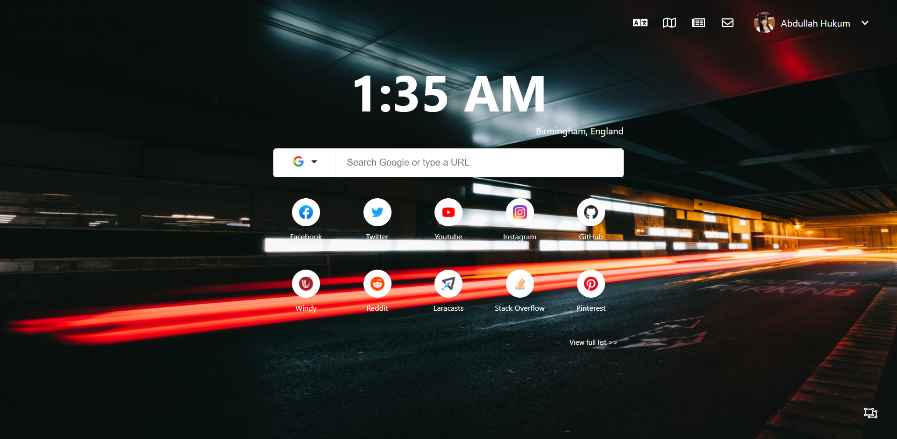
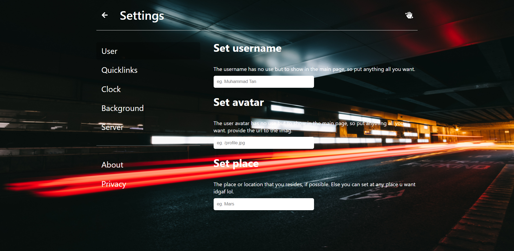

# Newtab Remastered

A project that was heavilly inspired by Google Chrome's new tab page and intends to mitigate some of the shortcoming and add more functionalities that suits the most for my current workflow.

## Screenshots

Here are some screenshots for the application. The background picture is a bad choice as some of the words in white colour does not contrast well. Currently dark background is only supported.

### Main page

### Settings page

## Features

- Supercharged search bar
- Customized quicklinks
- Quick access to favorite sites
- Fake profile and location
- Clock settings (rofl)

## Development

1. Install Vue CLI (Maybe not? I'm not sure)
2. After clone, run `yarn` to install deps
3. To serve on dev server, run `yarn serve`

## Todos

- [ ] Feat: Add animating background
- [ ] Feat: Video background
- [x] Feat: Add change background capability
- [ ] Feat: Add detect change on color saturation to color
- [x] Feat: Add a page for user to change username
- [x] Feat: Add a customization page for settings
- [ ] Feat: Add i18n and Japanese translation
- [ ] Feat: Add functionality to search for page
- [ ] Feat: Add functionality to add a page
- [x] Feat: Add return button to main page from setting page
- [x] Feat: Add clear or reset button
- [ ] Feat: Add a custom message component at quicklinks
- [ ] Feat: Add data validation and error message
- [ ] Enhancement: Enable the dropdown to be close when click elsewhere
- [x] Enhancement: Enable the selected service to be default
- [x] Feat: Autofocus hotkey (Command + K)
- [ ] Feat: Change service hotkey (Command + ?)
- [x] Enhancement: Develop the 404 Page properly
- [ ] Enhancement: Utilize vue-transition to provide transitons to pages and elements
- [ ] Enhancement: Beautify the reset confirmation popup
- [ ] Enhancement: Optimize overall app performance
- [x] Feat: Add an option whether to blur the bg or not
- [ ] Enhancement: Add MOBILE RESPONSIVENESS
- [ ] ...

## Category

The categories used to describe the webpages as a whole based on their characteristics and nature.

| Index | Category                 | Description                                                                               | Tags? |
| ----- | ------------------------ | ----------------------------------------------------------------------------------------- | ----- |
| 1     | Commerce                 | The website that involves any form of online commerce pattern.                            |       |
| 2     | Enterprise               | The website that belongs to any of the public or private company.                         |       |
| 3     | Utility                  | The website that provides utility tools and applications for miscellaneous uses.          |       |
| 4     | Streaming                | The website that provide any form of streaming services such as video and music           |       |
| 5     | Technology (Information) | The website that belongs to any form of Information Technologies such as programming etc. |       |
| 6     | University               | The website that belongs to higher educations around the world.                           |       |
| 7     | News                     | The website that is the media or news provided for any sort of languages.                 |       |
| 8     | Language                 | The website that promotes learning of languages with rich info.                           |       |
| 9     | Gallery                  | The website that provides a gallery of image that can be viewed, or downloaded.           |       |
| 10    | Finance                  | The website that involves monetary information and services such as crypto.               |       |
| 11    | Social Media             | The website that provide friending following features.                                    |       |
| 12    | Other                    | The website that does not fall into any of the categories.                                |       |

## To Nuxt or not to Nuxt

This is an ongoing debate with myself whether should Nuxt it but maybe not coz it is too muchwork.

## Attributions

There is a background photo shipped along with the app which is by Javier Garcia on [Unsplash](https://unsplash.com/) at [this link](https://unsplash.com/photos/jJbQBP_yh68)

The default profile picture was taken from Twitter and it belongs to [Twitter](https://twitter.com) and not my creation.
